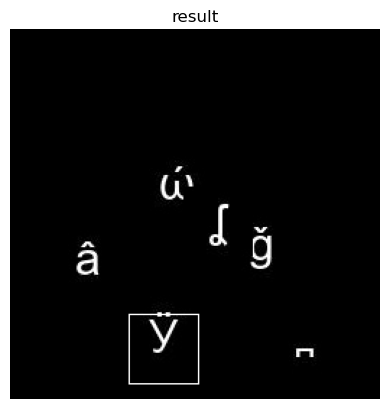

# Tensor 编程练习

请尝试使用学到的tensor知识，完成下述问题。

```python
import torch
import cv2
img = cv2.imread('./template.jpg')
```

### 1. tensor的创建、属性修改、索引、拼接、维度调整等

（1）使用opencv读取的图像默认是BGR三通道的ndarrays格式，数据类型是uint8。基于pytorch实现的神经网络往往要求输入数据使用float32类型，请创建一个和img具有相同内容的tensor，并将其数据类型调整为float32。

```python
img_t = torch.tensor(img, dtype=torch.float32, device='cpu')
```

（2）请取出该tensor表示的图像的上半部分，即对于尺寸为（48，48，3）的图像取出前24行得到尺寸为（24，48，3）的tensor，命名为img_top。类似地，请再取出图像的下半部分，得到另一个尺寸为（24，48，3）的tensor，命名为img_down。

```python
img_top = img_t[:24]
img_down = img_t[24:]
```

（3）请将img_down置于img_top上方对二者进行拼接，得到尺寸为（48，48，3）的tensor，命名为img_cat。

```python
img_cat = torch.cat([img_down, img_top], dim=0)
```

（4）在pytorch实现的神经网络中，往往要求输入图像具有(batch_size, channel, height, width)的维度顺序。请将拼接后的img_cat从(height, width, channel)的维度顺序调整为(batch_size, channel, height, width)的顺序，命名为img_pytorch, 其中batch_size应为1。

```python
img_pytorch = img_cat.permute(2, 0, 1).unsqueeze(0)
```

### 2. tensor的数学运算

（1）提供的模板图像是一幅黑白图像，可以很容易地根据三通道值之和是否为0来区分背景和前景。请据此得到img_pytorch的前景mask，命名为img_mask，img_mask应具有(batch_size, height, width)的维度，并且数据类型应为float32。

```python
mask = torch.zeros(48, 48, dtype=torch.float32, device='cpu')
for i in range(48):
    for j in range(48):
        if (img_pytorch[0][0][i][j] + img_pytorch[0][1][i][j] + img_pytorch[0][2][i][j]):
            mask[i][j] = 255
img_mask = mask.unsqueeze(0)
```

（2）请对img_pytorch的前景部分添加在[-50, 0]之间均匀分布的随机噪声，结果命名为img_noise，可以使用前面获得的前景mask。

```python
noise = mask - torch.rand(48, 48) * 50
for i in range(48):
    for j in range(48):
        if noise[i][j] < 0:
            noise[i][j] = 0
img_noise = img_pytorch - noise
```

# Tensor 编程大作业-模板匹配

学习了tensor的基础操作之后，我们可以使用tensor来完成一项简单的模板匹配问题。首先读取一幅图像以及一幅模板图像。

```python
import cv2
import torch
import matplotlib.pyplot as plt
image = cv2.cvtColor(cv2.imread("image.jpg"), cv2.COLOR_BGR2GRAY)
template = cv2.cvtColor(cv2.imread("template.jpg"), cv2.COLOR_BGR2GRAY)
plt.figure()
plt.imshow(image, cmap='gray')
plt.title('image')
plt.axis('off')
plt.figure()
plt.imshow(template, cmap='gray')
plt.title('template')
plt.axis('off')
```

```sh
(-0.5, 47.5, 47.5, -0.5)
```


OpenCV读取的图像是numpy的ndarrays格式，需要将其转换为tensor。

```python
image = torch.from_numpy(image)
template = torch.from_numpy(template)
```

获取图像和模板图像的尺寸，由于二者都是正方形，因此只需要得到图像和模板图像的边长。

```python
image_shape = image.size(dim=0)
template_shape = template.size(dim=0)
```

开始进行模板匹配。对图像进行遍历，按照从左到右、从上到下的顺序依次取出和模板同样大小的正方形区域（切片），对取出的区域计算与模板的相似度。对于两幅同样大小的图像$X$和$Y$，二者的相似度s可以按照如下公式计算：
$X_{norm} = \sqrt{\sum_i\sum_j X_{i,j}*X_{i,j}}$,
$Y_{norm} = \sqrt{\sum_i\sum_j Y_{i,j}*Y_{i,j}}$,
$s=\frac{\sum_i\sum_j X_{i,j}*Y_{i,j}}{X_{norm} * Y_{norm}}$.

```python
max_similarity = 0
matched_position = None
for i in range(image_shape - template_shape):
    for j in range(image_shape - template_shape):
        i_end = i + template_shape
        j_end = j + template_shape
        image_crop = image[i:i_end, j:j_end]
        image_crop_norm = torch.sqrt(torch.sum(torch.square(image_crop)))
        template_norm = torch.sqrt(torch.sum(torch.square(template)))
        similarity = torch.sum(image_crop * template) / (image_crop_norm * template_norm)
        if similarity > max_similarity:
            matched_position = (j, i)
            max_similarity = similarity
```

最后对于最大相似度大于0.8的匹配结果，认为匹配成功，对匹配的位置进行可视化之前，需要先将图像从tensor转化为numpy的ndarrays格式。

```python
if max_similarity <= 0.8:
    print("未匹配成功")
else:
    image = image.numpy()
    image = cv2.rectangle(image, matched_position, (matched_position[0] + template_shape, matched_position[1] + template_shape), color=255)
    cv2.imwrite("result.jpg", image)
    plt.figure()
    plt.imshow(image, cmap='gray')
    plt.title('result')
    plt.axis('off')
    
```

